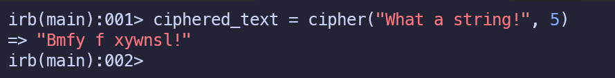
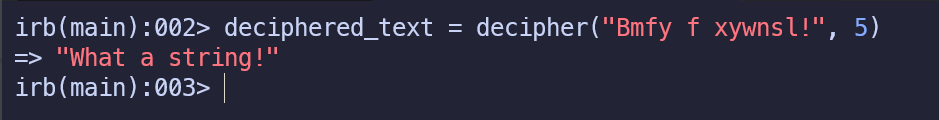
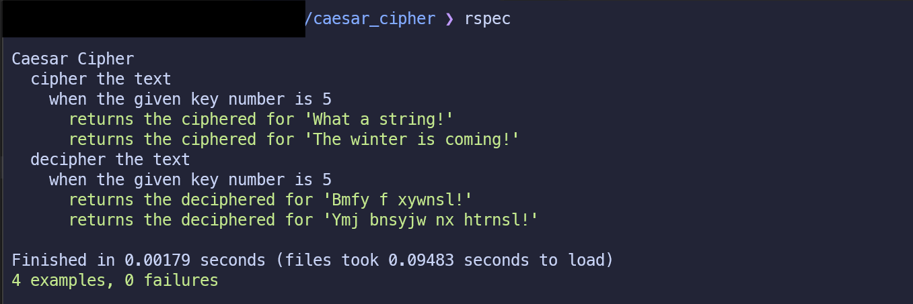

# The Caesar Cipher algorithm

## About the algorithm

This algorithm is written in Ruby, the goal of this algorithm is to practice some concepts while I was exploring in Ruby.

> [!IMPORTANT]
> I advise people to not use this algorithm in an production application

## About the Caesar Cipher

"In cryptography, a Caesar cipher, also known as Caesar’s cipher, the shift cipher, Caesar’s code or Caesar shift, is one of the simplest and most widely known encryption techniques. It is a type of substitution cipher in which each letter in the plaintext is replaced by a letter some fixed number of positions down the alphabet. For example, with a left shift of 3, D would be replaced by A, E would become B, and so on. The method is named after Julius Caesar, who used it in his private correspondence."

    <a href="https://en.wikipedia.org/wiki/Caesar_cipher">Wikipedia contributors. (2025, March 1). Caesar cipher. Wikipedia.</a>

## Cloning and installation

Clone this repository to your local machine. To do this, click on the green "Code" button at the top right of list of files and copy the link in the prompt. Then, run the following command in your terminal:

    git clone <link>

This will create a folder called 'caesar_cipher' inside the directory you ran the command in.

CD into that folder:

    cd caesar_cipher

Now before beginning work on the exercises, you'll want to install a gem called RSpec. RSpec is a popular Ruby testing framework that is used in this repository to provide you with tests that check your solutions.

To install RSpec, run the following command in your terminal:

    gem install rspec

You should see a message that says something along the lines of "6 gems installed" in your terminal. Verify that the installation was successful by simply running the following command:

    rspec

## Usage

There are two ways to try out this algorithm.

### 1 - Directly in interactive ruby console (IRB)

    irb -r ./lib/caesar_cipher.rb

From there on you can type directly the name of methods in the caesar_cipher file:

    a. cipher, or
    b. decipher

The methods is prepared to receive two inputs.

    1 - A string containing the text
    2 - The number used to jump from a letter to another

Check out the images below

### 2 - Unit tests execution

Once within the caesar_cipher cloned directory, you can type directly

    rspec

It runs all unit tests prepared for these cipher and decipher methods.

Check out the image below

## Support

There is no support provide for this algorithm

## Contributing

The repository does not accept contribution due to the fact it was rehearsal

## License

A short and simple permissive license with conditions only requiring preservation of copyright and license notices. Licensed works, modifications, and larger works may be distributed under different terms and without source code. [MIT](LICENSE)
